# Todo App

A React + TypeScript + Vite app that grows each module. So far it has:

- lifted todo state
- a live effect
- a race-safe user directory
- React Router
- a generic `useFetch<T>`
- an `AuthContext`
- a `useReducer` cart shared through context
- reusable `useLocalStorage` and `useDebounce` hooks
- a Vitest + React Testing Library suite

## Run it

```bash
npm install
npm run dev        # http://localhost:5173
npm test           # Vitest in watch mode (npx vitest run for a single run)
npm run typecheck  # tsc, strict mode
npm run build      # typecheck + production build
npm run lint
```

## Routes

| Path         | View                                                     |
| ------------ | -------------------------------------------------------- |
| `/`          | Redirects to `/todos`                                    |
| `/todos`     | `TodoApp`: add, toggle, delete, filter, clear completed  |
| `/users`     | `UserDirectory`: searchable list from JSONPlaceholder    |
| `/users/:id` | `UserDetail`: reads `id` with `useParams`                |
| `/shop`      | `Shop`: products from Fake Store API, with Add to cart   |
| `/cart`      | `Cart`: quantity steppers, remove, and `CheckoutSummary` |
| `*`          | `NotFound`: 404 catch-all                                |

Navigation uses `NavLink` and `Link`, so there are no full page reloads.

## Structure

```
src/
  main.tsx                     <BrowserRouter> → <AuthProvider> → <CartProvider> → <App>
  App.tsx                      <NavBar> + <Routes>
  api.ts                       API URLs, formatPrice()
  types.ts                     Todo, Filter, User, Product
  hooks/
    useFetch.ts                useFetch<T>(url) → { data: T | null, loading, error, refetch }
    useFetch.typecheck.ts      compile-time proof that data needs a null check
    useLocalStorage.ts         useState that survives a refresh (+ .test.ts)
    useDebounce.ts             value that settles after 500 ms (+ .test.ts)
  test/setup.ts                jest-dom matchers, cleanup, localStorage reset
  context/
    auth.ts                    AuthContext, useAuth()
    AuthProvider.tsx           user state, signIn(email), signOut()
    cartReducer.ts             CartAction union + pure cartReducer
    cart.ts                    CartContext, useCart()
    CartProvider.tsx           useReducer + itemCount / subtotal
  components/
    NavBar.tsx                 links, cart badge, ThemeToggle, AuthControls
    AuthControls.tsx           validated sign-in form or "Hi, {user.email}" (+ .test.tsx)
    ThemeToggle.tsx            System / Light / Dark, saved with useLocalStorage
    CheckoutSummary.tsx        no props, reads useCart() and useAuth()
    WindowWidth.tsx            live resize effect
    todos/                     TodoApp, AddTodo, TodoList, FilterBar
  pages/
    UserDirectory.tsx          debounced search with raw vs debounced display (+ .test.tsx)
    Shop.tsx  Cart.tsx  UserDetail.tsx  NotFound.tsx
```

## Module 2: architecture

### Generic `useFetch<T>`

`useFetch<User[]>(url)` returns `{ data: User[] | null; loading: boolean; error: string | null }`.

- **No hidden `any`:** `response.json()` is typed `any`, so the hook stores the result as `unknown` and casts to `T` in one place. The lint rule `typescript/no-explicit-any` is set to `error`.
- **`data` needs a null check:** [`useFetch.typecheck.ts`](src/hooks/useFetch.typecheck.ts) is part of `npm run typecheck`. It shows that `users.data.map(...)` is rejected with **TS18047: 'users.data' is possibly 'null'**, and that inside `if (users.data)` the value narrows to `User[]`.
- **Stale requests can't win:** changing the URL aborts the previous request and ignores whatever it returns.

### AuthContext

- `useAuth()` throws if it's called outside `<AuthProvider>`, so a consumer sitting above its provider fails loudly instead of silently reading `null`.
- `NavBar` shows an email form with **Sign in** when signed out, and **Hi, {user.email}** with **Sign out** when signed in.

### CartContext and reducer

```ts
type CartAction =
  | { type: 'ADD_ITEM'; product: Product }
  | { type: 'REMOVE_ITEM'; productId: number }
  | { type: 'UPDATE_QUANTITY'; productId: number; quantity: number }
```

- **Add to cart** dispatches `ADD_ITEM`. The **−** and **+** buttons dispatch `UPDATE_QUANTITY`, and **×** dispatches `REMOVE_ITEM`.
- `UPDATE_QUANTITY` with a quantity of 0 or less removes the line.
- **No prop carries cart data.** `Cart`, `CheckoutSummary`, and the `NavBar` badge each call `useCart()` themselves.

**Audit checklist:**

- [x] Every consumer sits below its provider. `main.tsx` wraps `<App>` in both providers, and the hooks throw otherwise.
- [x] The reducer is pure. It has no `fetch`, `localStorage`, or `console`, and never changes `state` in place.
- [x] The `default` branch returns `state` untouched. `action satisfies never` there also makes an unhandled action type a compile error.

**How the action type keeps quantity -1 out of the cart:**
Because `CartAction` is a discriminated union, `ADD_ITEM` carries no quantity field at all and can only create a line at 1 or add one to it. That leaves `UPDATE_QUANTITY` as the only way to set a quantity, and the reducer handles it by removing the line whenever the quantity is 0 or less. So a line with quantity -1 can never be stored.

## Module 3: custom hooks and tests

### `useLocalStorage(key, initial)`

The hook returns `[value, setValue]`, just like `useState`. It reads the saved value once on mount and writes it back whenever it changes. If storage is blocked or the saved JSON is corrupt, it falls back to the initial value. It persists:

- the **theme**: System, Light or Dark, set with the toggle in the header. `index.html` applies the saved theme before first paint, so a refresh never flashes the wrong colours.
- the **todos**: `TodoApp`'s hand-rolled localStorage code now uses the hook instead.

### `useDebounce(value, 500)`

`useRef` holds the timer, `useEffect` starts it, and the cleanup clears it. The user search box shows the **raw** and **debounced** values side by side, and fetches only with the debounced one. Typing "Clem" sends one request instead of four.

### Tests

Run them with `npx vitest run`. There are 24 tests in 4 files, each file next to the code it tests:

| File | What it proves |
|---|---|
| `components/AuthControls.test.tsx` | The form renders (`getByLabelText('Email')`). Typing and submitting with `userEvent` shows the validation error. A valid email signs in, and `queryByRole('alert')` and `queryByLabelText('Email')` return `null`. Signing out restores the form. Edge cases: empty, whitespace-only, trimming, no dot in the domain, error clears on typing. |
| `pages/UserDirectory.test.tsx` | **Async:** the skeleton shows, then `findByRole('link', { name: /Leanne Graham/ })` waits for data, and `queryByRole('list', { name: 'Loading users' })` is `null`. Also covers error and retry. Debounce edge cases: rapid typing sends one request, raw vs debounced values, empty results, whitespace-only input. |
| `hooks/useDebounce.test.ts` | With fake timers: the delay, the timer restarting on each change, and no pending timer after unmount. |
| `hooks/useLocalStorage.test.ts` | The default value, writing, restoring after a remount (like a refresh), functional updates, and the fallback for corrupt JSON. |

`fetch` is mocked with `vi.stubGlobal`, so the tests don't depend on the network.

**Audit checklist:**

- [x] Every hook name starts with `use`, and hooks are called only at the top level of components and other hooks. `react/rules-of-hooks` is set to `error` in the linter.
- [x] Every `setTimeout` has its `clearTimeout`. The only timer is in `useDebounce`, and a test checks `vi.getTimerCount()` is `0` after unmount.
- [x] Queries mirror what a user sees and does: labels, roles and visible text only. There are no test IDs (`grep -r TestId src` finds nothing).
- [x] Tests assert behaviour, not implementation: what's on screen and which requests were sent, never component state.

**What broke when I removed the debounce cleanup:**
Without `clearTimeout`, every keystroke's timer still fired, so the debounced value stepped through "C", "Cl" and "Cle" before "Clem" and the search sent a request for each one. Five tests failed, and one hung for 4½ minutes while stale timers kept firing after the component was gone.

## Effects and what their cleanup prevents

- **`WindowWidth` (resize listener):** the cleanup removes the `resize` listener, so an unmounted component is never updated and StrictMode's remount doesn't leave duplicate listeners behind.
- **`useFetch` (used by `UserDirectory`, `UserDetail`, and `Shop`):** the cleanup aborts the request and sets `cancelled = true`, so when the URL changes mid-request, the slower, stale response can't overwrite the current one.
- **`useDebounce` (timer):** the cleanup clears the pending timeout on every change and on unmount, so only a value that sits still for 500 ms gets through, and no timer fires after the component is gone.
- **`useLocalStorage` (save to storage):** no cleanup is needed, because it's a synchronous write that leaves nothing running.

## AI use

Some briefs asked for code to be hand-written. At my request, an AI assistant (Claude) wrote it instead, along with the rest of each module. The commits that added it say so too.

- **Module 2** (AuthContext, cart reducer and context): `src/context/auth.ts`, `AuthProvider.tsx`, `cartReducer.ts`, `cart.ts`, `CartProvider.tsx`
- **Module 3**: `src/hooks/useLocalStorage.ts`, and the arrange-act-assert test skeletons in `src/components/AuthControls.test.tsx`. The brief also allowed the edge-case tests to be AI-generated.

## Screenshots

| | |
|---|---|
| **`npx vitest run`: 24 passed** | 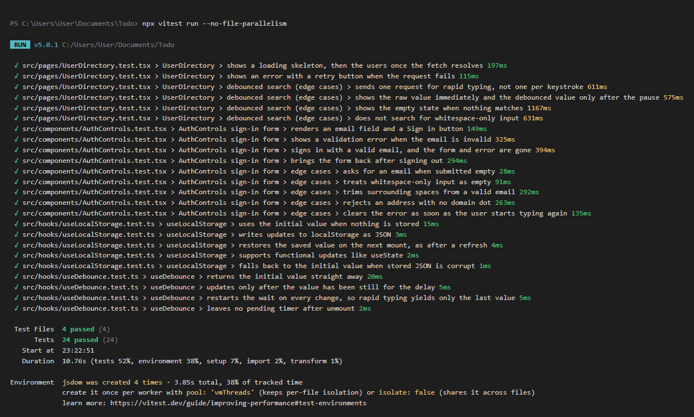 |
| Debounce: mid-typing (raw "Clem", debounced still empty) | 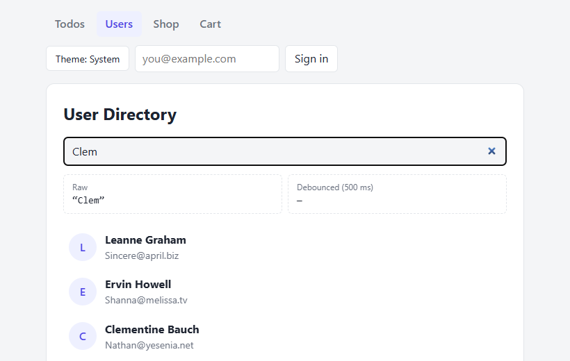 |
| Debounce: settled, one search sent | 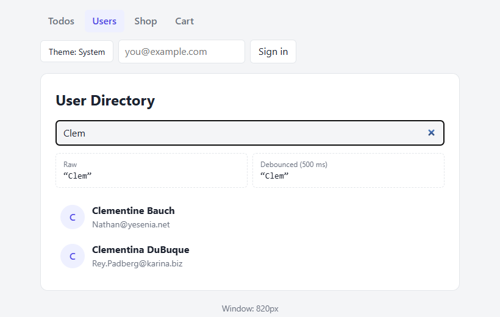 |
| Sign-in validation error | 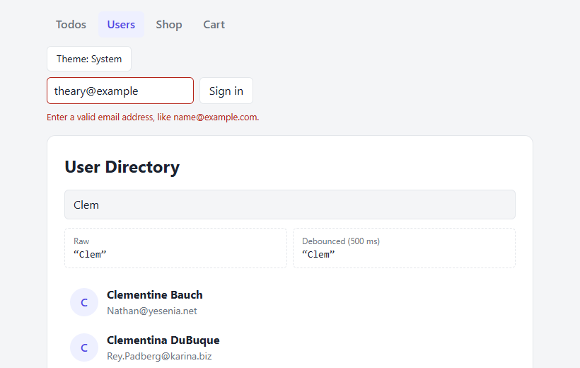 |
| NavBar: signed out | 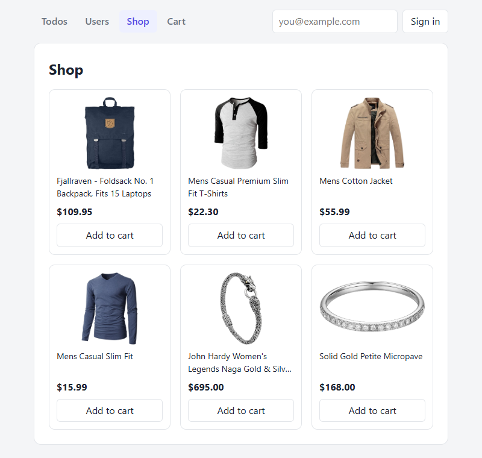 |
| NavBar: signed in | 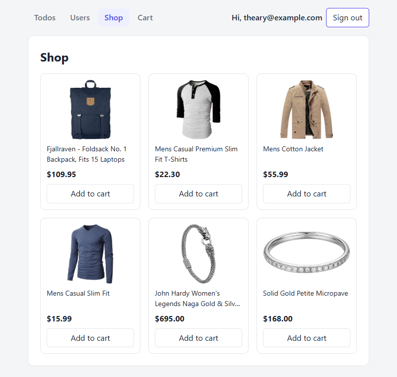 |
| Cart: T-Shirt at quantity 1 (highlighted) | 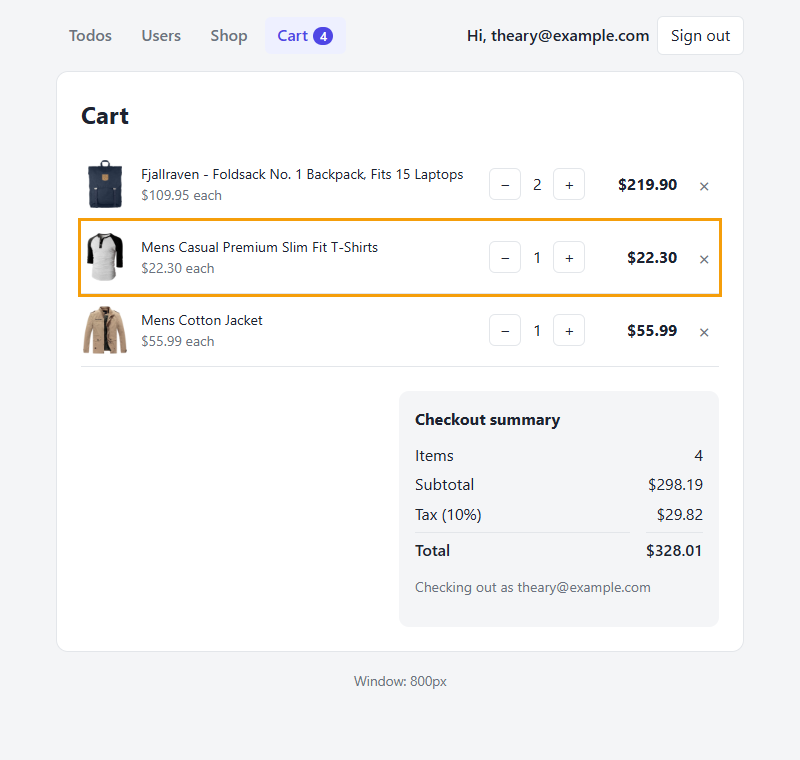 |
| Cart: after **−**, the T-Shirt line is gone | 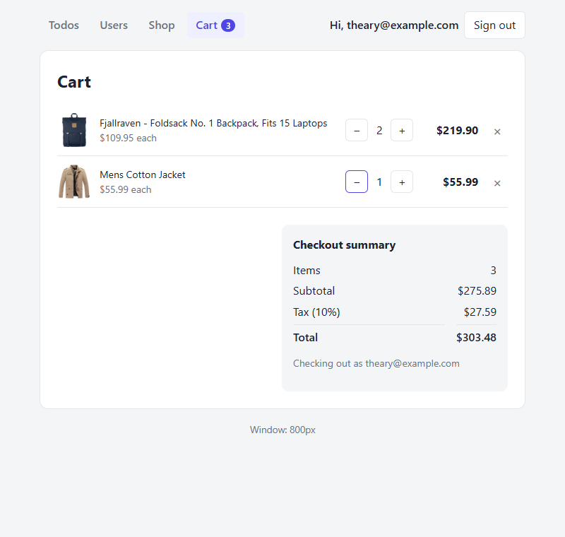 |
| Todos: all | 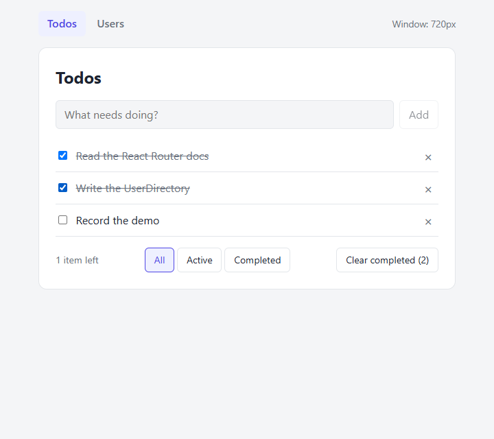 |
| Todos: Active filter | 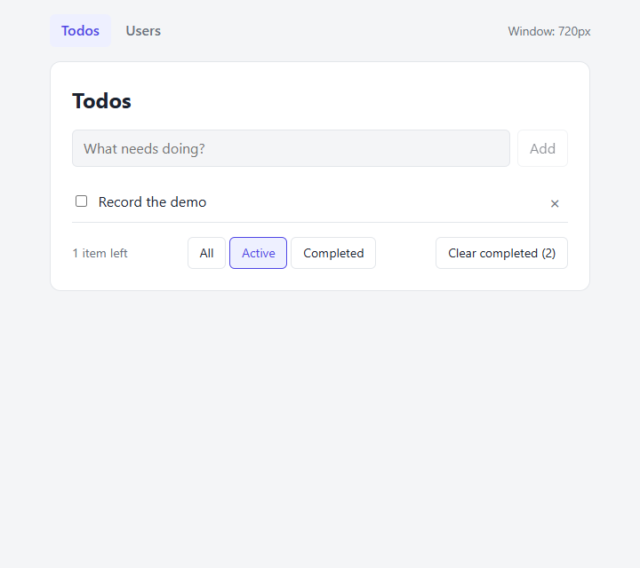 |
| Todos: Completed filter | 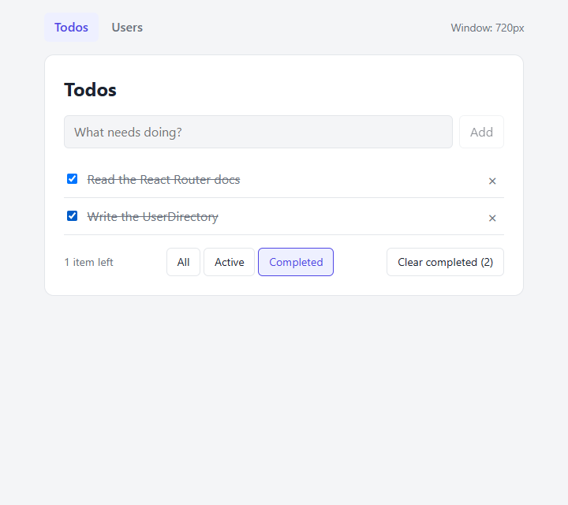 |
| Todos: after "Clear completed" | 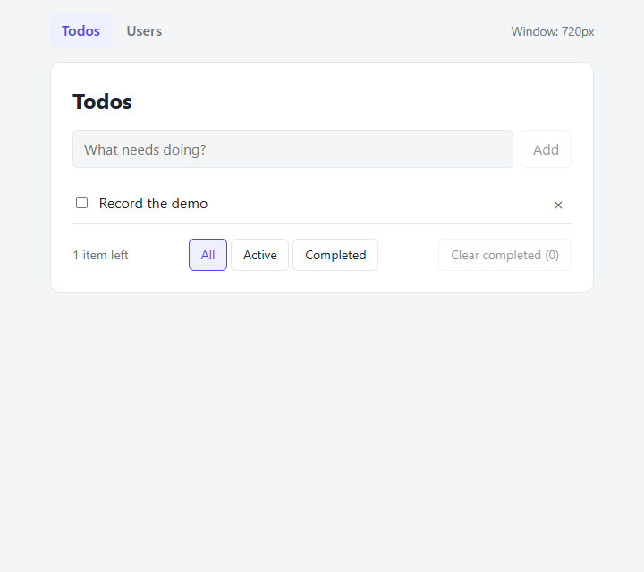 |
| Users: loading skeleton | 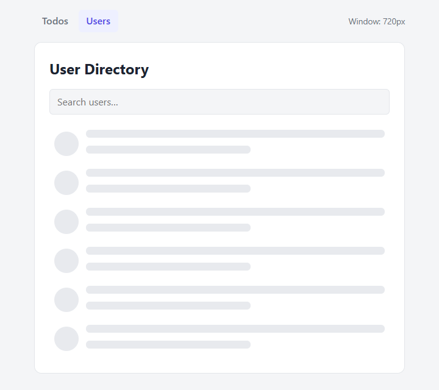 |
| Users: loaded | 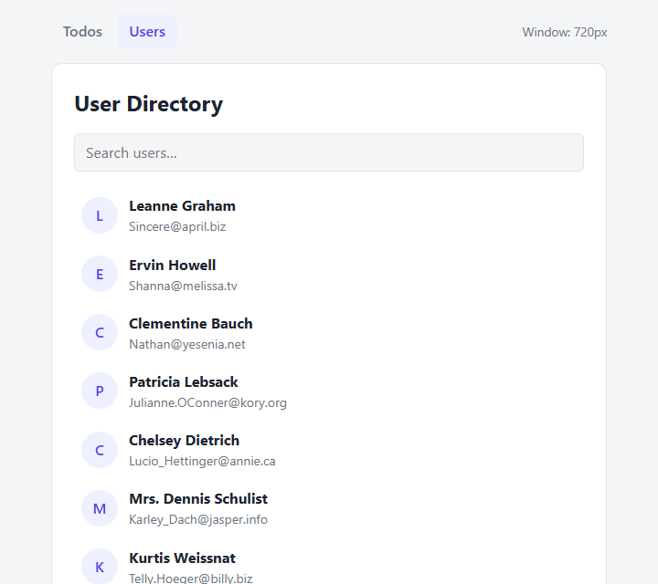 |
| Users: empty search | 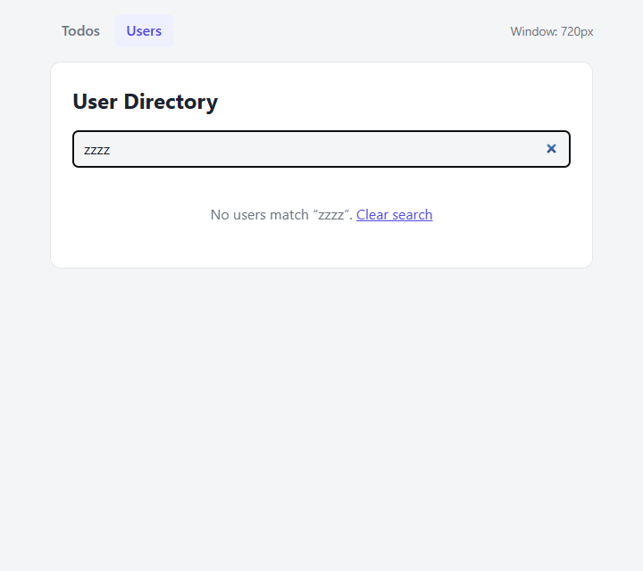 |
| Users: error | 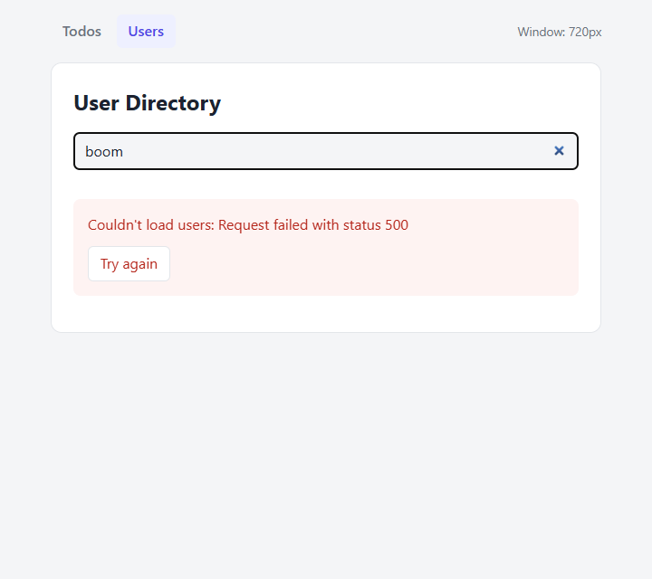 |
| `/users/3` opened directly | 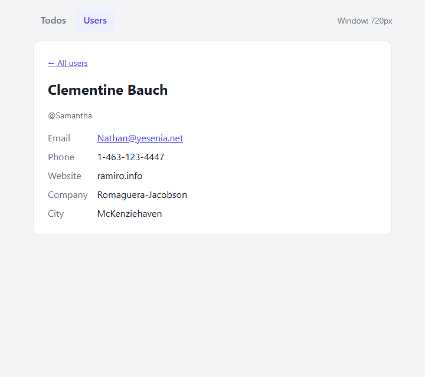 |
| Garbage URL → 404 | 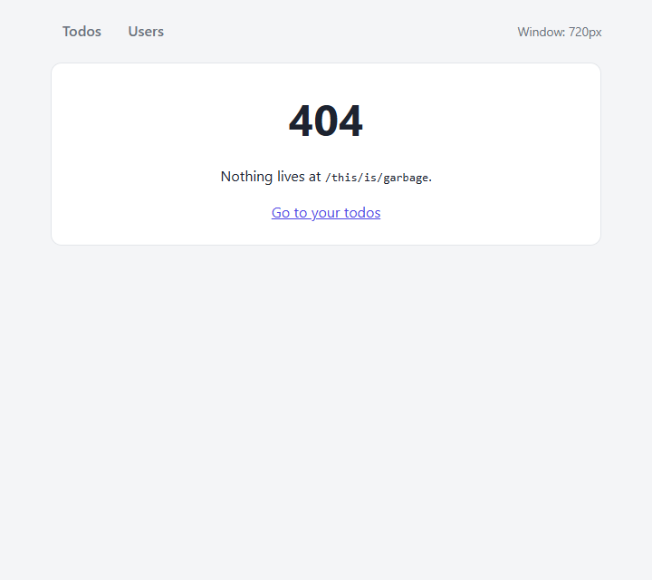 |

To see the loading or error states yourself, use DevTools → Network and throttle to "Slow 4G" or "Offline".
